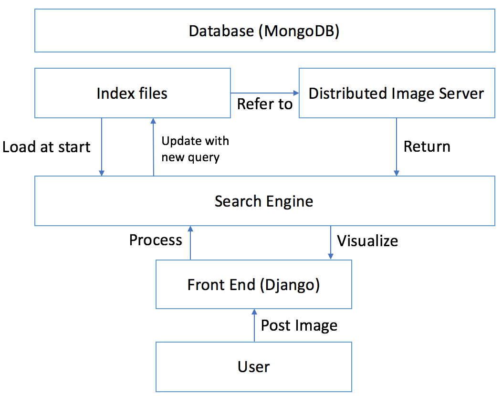

# The Introduction to ISeeNN System
This is a comprehensive document about our CNN based image retrieval system __ISeeNN__ building procedure.

The phrase **ISeeNN** can be expanded as *I See (with) CNN*.


## System Overview
The system consists of __three__ principal components:

- A distributed __Image Serving__ system
- A __Search Engine__ for running retrieval
- A __Front End__ for user interaction

The system is featured in:

- Support multiple CNN models, feature types with dynamic switch
- Support index update with new queries
- Support specifying dataset coverage
- Support user session to record feedback
- Open API for new algorithms
- Support image URL distribution from multiple internal servers

The framework of our system can be illustrated as:

## Setup
In this part, I will show the system setup details. 

Our system is built upon a number of linux servers. Essentially, **ISeeNN** is not a distributed system, but only with supporting of image storage and fetch from multiple servers.

Here is the configuration of our premier implement:

| ID | Operating System | Role | Internal IP | GPU | Memory |
|:---------:|------------------|------|-------------|---|:---:|
| 1 | Ubuntu 14.04 x64 | Front End & Retrieval System & Mongo Server | 192.168.6.232 | K80 x 4 | 64G |
| 2 | Open Suse 13.2 x64 | Image Server | 192.168.104.244 | K40 x 2 | 64G |
| 3 | Open Suse Leap 42.1 x64 | Image Server | 192.168.102.200 | GeForce GTX 660 Ti | 16G |

It can be seen that we do not rely on the very same operating system for different servers. We choose **Server 1** as the principal server because it has relatively higher computing resource. Of course it can also serve as an image server.

In the following we first focus on the configurations on **Server 1**.

### Database Setting
We use [MongoDB](https://www.mongodb.com) v3.4.1 as the backend storage database. Contents in the database include:

- index of the image dataset (``feature_id -> image_id``)
- image distribution information (``image_id -> image_url``)


Because the apt repository is old for MongoDB, we directly download the binary files.

```bash
$ wget https://fastdl.mongodb.org/linux/mongodb-linux-x86_64-ubuntu1404-3.4.1.tgz
$ tar zxvf mongodb-linux-x86_64-ubuntu1404-3.4.1.tgz
$ sudo cp mongodb-linux-x86_64-ubuntu1404-3.4.1/bin/* /usr/local/bin
```
To initialize the database, we first create admin users for the ***admin*** and our ***image_retrieval*** database.

We use the script written by [frodenas](https://github.com/frodenas/docker-mongodb/blob/master/scripts/first_run.sh) for the initialization. 

```bash
# first_run.sh
#!/bin/bash
 USER=${MONGODB_USERNAME:-mongo}
 PASS=${MONGODB_PASSWORD:-$(pwgen -s -1 16)}
 DB=${MONGODB_DBNAME:-admin}
 DBPATH=/db/mongo # set your own db_path here
 if [ ! -z "$MONGODB_DBNAME" ]
 then
     ROLE=${MONGODB_ROLE:-dbOwner}
 else
     ROLE=${MONGODB_ROLE:-dbAdminAnyDatabase}
 fi

 # Start MongoDB service
 mongod --dbpath $DBPATH --nojournal &
 while ! nc -vz localhost 27017; do sleep 1; done

 # Create User
 echo "Creating user: \"$USER\"..."                                                                           
 mongo $DB --eval "db.createUser({ user: '$USER', pwd: '$PASS', roles: [ { role: '$ROLE', db: '$DB' } ] }); "
 
 # Stop MongoDB service
 mongod --dbpath $DBPATH --shutdown                                                                                                                                                                                     
 echo "MongoDB User: \"$USER\""
 echo "MongoDB Password: \"$PASS\""
 echo "MongoDB Database: \"$DB\""
 echo "MongoDB Role: \"$ROLE\""
```

First, create a admin user for the ***admin*** database, by

```bash
$ ./first_run.sh
MongoDB User: "mongo"
MongoDB Password: "xxxxxxxxxxxxx"
MongoDB Database: "admin"
MongoDB Role: "dbAdminAnyDatabase"
```

Then, create a *dbOwner* user for the ***image_retrieval*** database, by

```bash
$ export MONGODB_USERNAME=webclient
$ export MONGODB_DBNAME=image_retrieval
$ ./first_run.sh
MongoDB User: "webclient"
MongoDB Password: "xxxxxxxxxxxxx"
MongoDB Database: "image_retrieval"
MongoDB Role: "dbOwner"
```
Here I hided the password. Remember to save the user information for further use.

After the initialization, start the mongod server with config file
``/db/mongodb.conf``

```bash
# /db/mongodb.conf
dbpath=/db/mongo/
logpath=/db/mongodb.log
logappend=true
journal=true
auth = true
```

```bash
$ mongod --config /db/mongodb.conf
```

Now test your database

```bash
$ mongo
MongoDB shell version v3.4.1
connecting to: mongodb://127.0.0.1:27017
MongoDB server version: 3.4.1
> use image_retrieval
switched to db image_retrieval
> db.auth('webclient', 'xxxxxxxxxxx')
1
```

### Django Development Environment

We use Python to develop the web service, and to extract CNN features with [Tensorflow](https://www.tensorflow.org) Python interface.

In this part we will config Python with Django module for web service and its MongoDB backend 

It is benificial to create standalone python runtime environment with [virtualenv](https://virtualenv.pypa.io/en/stable/).

Install ``virtualenv``:

```bash
$ sudo pip install virtualenv
```

Now in your workspace, create and enter a virtualenv environment:

```bash
$ virtualenv --no-site-packages -p python3 image_retrieval
$ cd image_retrieval
$ source bin/activate
```

Setup [Django](https://www.djangoproject.com), [MongoEngine](http://mongoengine.org), and [Pillow](http://pillow.readthedocs.io/en/latest/#):

```bash
$ pip install django
$ pip install mongoengine
$ pip install Pillow
```

Then setup your [TensorFlow](https://www.tensorflow.org) under the instruction of the website.

Now we have Python environment as (depending on your own environment):

```bash
$ pip freeze
appdirs==1.4.0
Django==1.10.5
mongoengine==0.11.0
numpy==1.12.0
olefile==0.44
packaging==16.8
Pillow==4.0.0
protobuf==3.2.0
pymongo==3.4.0
pyparsing==2.1.10
six==1.10.0
tensorflow==0.12.1
```

And let's start our **ISeeNN** project:

```bash
$ django-admin startproject ISeeNN
$ tree ISeeNN
ISeeNN
├── ISeeNN
│   ├── __init__.py
│   ├── settings.py
│   ├── urls.py
│   └── wsgi.py
└── manage.py
```

To work with the MongoDB backend, modify the ``DATABASE`` setting in ``ISeeNN/settings.py`` as:

```python
import mongoengine
...
DATABASES = {
    'default': {
        'ENGINE': '',
    }
}

_MONGODB_USER = 'webclient'
_MONGODB_PASSWD = 'xxxxxxxxxxxxxx'
_MONGODB_HOST = '192.168.6.232'
_MONGODB_NAME = 'image_retrieval'
_MONGODB_DATABASE_HOST = \
    'mongodb://%s:%s@%s/%s' \
    % (_MONGODB_USER, _MONGODB_PASSWD, _MONGODB_HOST, _MONGODB_NAME)

mongoengine.connect(_MONGODB_NAME, host=_MONGODB_DATABASE_HOST)

```

And configure the ``TIMEZONE = 'Asia/Shanghai'``.

Due to the weak support of Django for MongoDB, we are not using the admin component for this version. So let's comment the related code in ``urls.py``

```python
from django.conf.urls import url
# from django.contrib import admin

urlpatterns = [
    # url(r'^admin/', admin.site.urls),
]
```

OK! now lanch the server by

```bash
./manage.py runserver 8000
```

Then open your browser to brows ``http://localhost:8000`` to test it.

### TBD